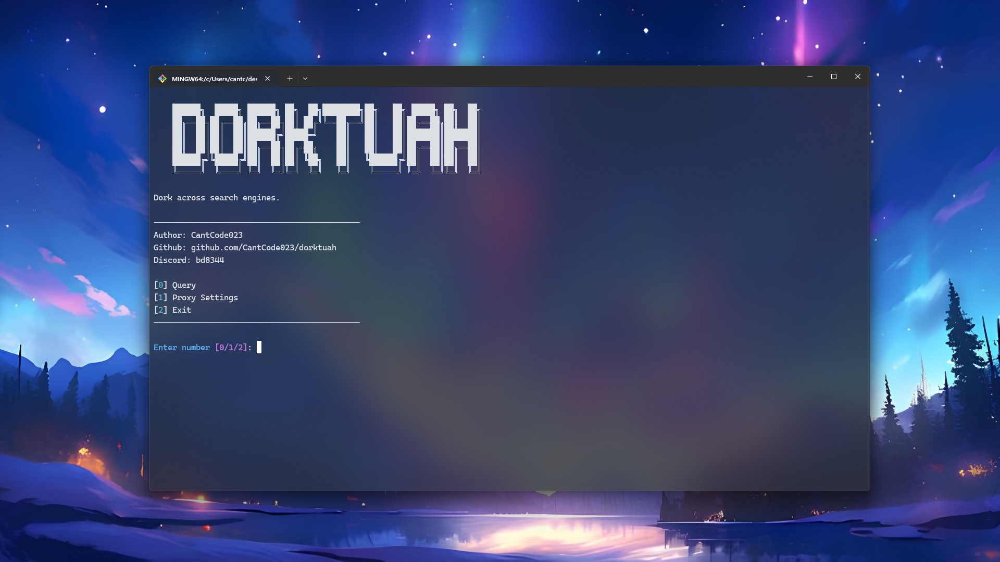

[](https://github.com/CantCode023/dorktuah/releases/)
[](#license)
Released under [MIT](./LICENSE) by [@CantCode023](https://github.com/CantCode023).

# About

Dorktuah is a powerful Python tool designed for advanced Google dorking and web scraping through proxy rotation. It leverages multiple search engines while maintaining anonymity through an extensive proxy system. The project aims to provide researchers, security professionals, and developers with a reliable tool for gathering information while avoiding rate limiting and IP blocks.

Key features:
- Automated proxy rotation system
- Support for multiple proxy types (HTTP, SOCKS4, SOCKS5)
- Built-in proxy scraper with 100+ sources
- Proxy health checking and validation
- Clean and structured search results
- Rate limit avoidance through proxy rotation
- Custom proxy list support

The name "Dorktuah" combines "dork" (referring to Google dorking) with "tuah" (meaning luck/fortune in Malay), signifying a fortunate/successful dorking tool (also referencing to hawktuah because this project is hawktuah).

> [!IMPORTANT]
> Remember to use this tool responsibly and in accordance with the target website's terms of service and applicable laws.

---

# Installation

To use Dorktuah, follow these steps:

1. Clone the repository:
```bash
git clone https://github.com/CantCode023/dorktuah.git
```

2. Install required dependencies:
```bash
pip install -r dorktuah/requirements.txt
```

3. Run CLI and you're done!
```bash
python dorktuah
```



---

# TODOLIST:

- [x] set up project structure
- [x] write proxy rotation implementation
  - proxy_pool as function
  - requests.get(proxies=ProxyPool()) for easier rotation
  - ProxyPool()
    - type:Literal["socks4", "socks5", "http", "all"] = "all"
    - get proxies from proxies.txt
  - [x] write a proxy checker to make sure the returned proxy is alive
  - [ ] convert proxypool to class to allow argument inheritance for easier argument initalization across methods
- [x] write engine implementation
  - use BeautifulSoup
  - Engine()
    - proxy_pool implementation
- [x] write etools scraping implementaiton
  - [x] do pagination to retrieve **every** results
    - load_more_results, pagination, get_source, search
    - combine those 4
    - 1. search, open ectools and search for the query
    - WE ALSO WANT TO GIVE THE USER THE ABILITY TO GET NEXT RESULT
    - def has_more_results()
    - if has_more_results then show "click enter to go next" in cli
    - if doesn't then don't show it.
    - if click enter then load_more_results()
    - get source and return
- [x] implement proxy pool in engine.py
- [x] make it into a cli using colorama and rich _maybe_?
  - [x] make header "dorktuah"
  - [x] make subheader "Dork across search engines."
  - [x] put credentials (author, github, discord)
  - ~~make textbox to ask for query using rich _maybe_~~
- [x] add config in cli (write config.json file)
  - [x] add proxy support
    - [x] enable proxy (y/n)
    - [x] use custom proxy (y/n)
    - [x] proxy type (socks4/socks5/http/all)
    - [x] proxy path
      - [x] add path checking to check if it exists
    - [x] source_limit (1-100)

---

# FUTURE TODOLIST:

- [x] add scrape proxies and check proxies to ProxyPool to get newest proxies
- [ ] make proxy checker faster